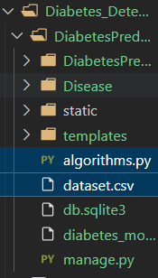

# Diabetes Prediction System deployed as Django WebApp!

## Step 1 : Creating Project and Setting up the server and application

Before deploying any Machine Learning Model as Django application, you need to create a Django WebApp.
`django-admin startproject Project_Name`

If you have Django Project, then you need to run it on server and for that you need to go into Project Directory and run following command:
`python manage.py runserver`

If you can successfully start the Project, you need to create a Django App.
`django-admin startapp App_Name`

Make sure you are in your project directory

Example :

```sh
   ? django-admin startproject Diabetes_Detection
   ? cd Diabetes_Detection
   ? python manage.py runserver
   ? django-admin startapp Disease

```

## Step 2 : Creating a Machine Learning Model and adding dataset in the project

Mention your algorithms.py file and your dataset in the same folder where your application is present. 


## Step 3 : Creating joblib file to dump Machine Learning Model.

Make sure joblib is installed in your system.
To install joblib, use : `pip install joblib`.
Don't forget to import joblib in your algorithms.py file.


## Step 4 : Create the templates and static folder in your projects directory.

Register your templates and static folder inside settings.py file in your project directory.


## Step 5 : Adding your logic in views.py file. Add your HTML and CSS content for forms in templates folder and static folder respectively.


## Step 6 : Adding URL in urls.py file in your project directory.

In your project's urls.py file, add the URL of your application.


You need to set path inside views.py file that would be rendered when you would run your project on server.
In the application's urls.py file, you need to set path for the form that would be rendered when you would run your project on server.
